# arcgis-pro-sdk-cim-viewer
Contains the source code for the 'CIM Viewer' ArcGIS Pro Add-in which allows inspection and modification of underlying CIM models.

<!-- TODO: Fill this section below with metadata about this sample-->
```
Language:              C#
Subject:               Framework, Map Authoring
Contributor:           ArcGIS Pro SDK Team <arcgisprosdk@esri.com>
Organization:          Esri, http://www.esri.com
Date:                  6/22/2022
ArcGIS Pro:            2.8
Visual Studio:         2019
.NET Target Framework: .NET Framework 4.8
```

## Overview
<!-- TODO: Explain how this sample can be used. To use images in this section, create the image file in your sample project's screenshots folder. Use relative url to link to this image using this syntax:  -->
The CIMViewer can be used to examine layer, map (2D or 3D), and layout CIM definitions. Select a layer, map, scene, or layout in the TOC with the viewer open and its CIM definition will be loaded into the XML Editor. The XML Editor uses the AvalonEdit control which provides syntax colorization and formatting. Cut, Copy, Paste, and XML Validation have been added in the Add-in so the XML editing experience is reasonably functional though not as rich as a fully fledged commercial editor like XML Spy. However, it is a simple task of copy/pasting the CIM XML into a commercial editor if that level of XML manipulation is desired.

The Save button will save any changes you make back to the layer, map, scene, or layout whose CIM definition you loaded. However, there is not much of a safety net to protect you against making really bad xml or other inadvertant mistakes so use the `Save` functionality with caution. The primary use of the CIM Viewer is to allow you, the developer, to decipher the inner workings or "guts" of the CIM and how it affects the configuration of your Pro project at any given point in time. In other words, it is a <u>learning or educational tool</u> that can be used to help you in your Pro development efforts. It is **not** a customization or configuration tool.

A second add-in, CIMViewerAnno*, has been added to the CIMViewerSolution. CIMViewerAnno adds a dockpane that allows you to view the CIMTextGraphic of annotation features. With at least one annotation layer loaded into the current map, select annotation features to load their CIM (similar to the way the CIMViewer works). You will see a preview image of the selected text graphic along with its CIM definition. You can use the standard Pro select tool or the custom select tool provided with the CIMViewerAnno add-in.  

&#42;Not included in the 3.3 sample.

At **3.0** the CIM Viewer has been updated to incorporate API breaking changes as well as the move to .NET 6 and Visual Studio 2022. However, because many developers may still be on 2.x versions of Pro, the original 2.x solution and projects have been left in the master branch of the repo (for convenience).

For the 3.0+ (latest) version you must:
Install ArcGIS Pro 3.0+ and SDK, Visual Studio 2022 v17.2 or better (and .NET 6.0.5). Open the solution called CIMViewer_3.0.sln.

At **3.3** the CIM Viewer has been updated to incorporate .NET 8 and Visual Studio 2022 17.8 (or later). However, because many developers may still be on 2.x versions and  3.0 - 3.2 versions of Pro, the original 2.x solution, 3.0 solution and associated projects have been left in the master branch of the repo (for convenience). Note: the CIMViewerAnno tool is only in the 2.x and 3.0 versions of the solution. It is not included in the sample for 3.3+.

For the 3.3+ (latest) version you must:
Install ArcGIS Pro 3.3+ and SDK, Visual Studio 2022 v17.8 or better (which includes .NET 8). Open the solution called CIMViewer_3.3.sln.

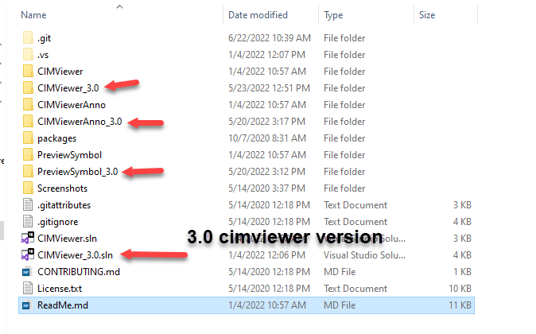

## ArcGIS Pro 3.3 (minimum requirement)

 * Migrated to ArcGIS Pro 3.3 and Visual Studio 2022 v17.8+ and .NET 8
   
## ArcGIS Pro 3.0 (minimum requirement)

 * Migrated to ArcGIS Pro 3.0 and Visual Studio 2022

## ArcGIS Pro ~2.5~ 2.8

 * Support for layouts and layout elements added
 * A CIMViewerAnno project is added to allow you to view and edit anno text graphics CIM xml.
 * .NET 4.8 and Visual Studio 2019 is required
 * Enhancements added for new events added in 2.8.
 * Updates to the CIMPreviewSymbol
 
 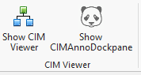 

 Note: For the 2.x flavor:
**You must install Pro SDK ~2.5~ 2.8**. This version of the CIM Viewer will not work with earlier versions of Pro. They do not contain the layout and annotation APIs.

## CIM Viewer tool, CIMViewerAnno, and PreviewSymbol resources

All add-ins require the [ArcGIS Pro SDK](https://github.com/esri/arcgis-pro-sdk#installing-arcgis-pro-sdk-for-net)

All add-ins require a third party nuget called AvalonEdit and a third party nuget called Extended.Wpf.Toolkit. 

* [Avalon Edit nuget](https://www.nuget.org/packages/AvalonEdit)
* [Extended.Wpf.Toolkit](http://wpftoolkit.codeplex.com/)

When you first rebuild your solution those nuget are usually updated (or installed) auomatically. However, if that is not the case, you can use the NuGet Package manager inside Visual Studio (Tools->NuGet Package Manager->Manage NuGet Packages for Solution...).

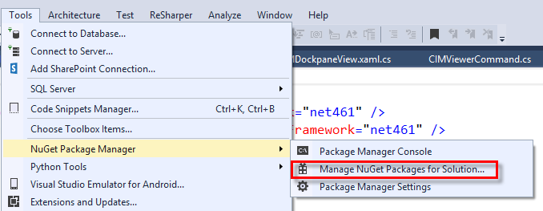

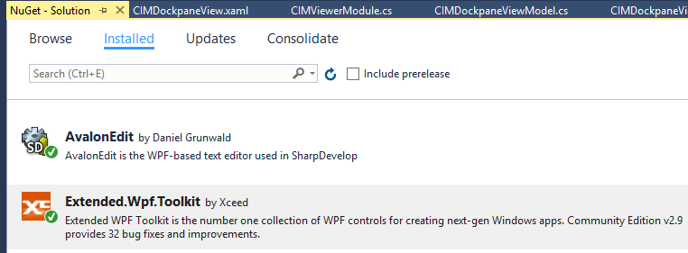

You don't have the NuGet Package Manager installed? Find it [here](https://visualstudiogallery.msdn.microsoft.com/5d345edc-2e2d-4a9c-b73b-d53956dc458d) or go to Tools->Extensions and Updates and search for "NuGet Package Manager"
You are not familiar with NuGets? Watch [this tutorial](https://www.youtube.com/watch?v=F8sx49NdCNk)

Note: PreviewSymbol uses a Nuget Package reference as opposed to the older "Packages.config". Visual Studio 2019 should be used to build the PreviewSymbol add-in.

**Note:**  
If your References to the ArcGIS Pro Assemblies in the CIMViewer solution are broken (because your ArcGIS Pro is installed to a different location than the CIMViewer add-in projects reference) don't forget to use the [Pro Fix References](https://github.com/esri/arcgis-pro-sdk#arcgis-pro-sdk-for-net-utilities) utility that comes with the Pro SDK to fix them

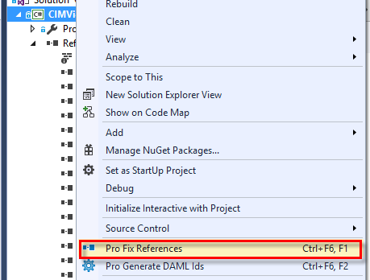

## How to use the CIM Viewer tool

1. Make sure you have re-built the CIM Viewer tool and the add-in is available in ArcGIS Pro.  
1. Start ArcGIS Pro.  
1. Open any project file with a map or scene. Click on the "CIM Viewer" tab on the ribbon and then on the "Show CIMViewer" button.  
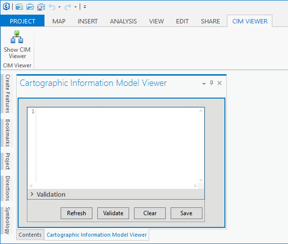  
1. Open the "Contents" dockpane and select any layer in the TOC of the map or scene.  
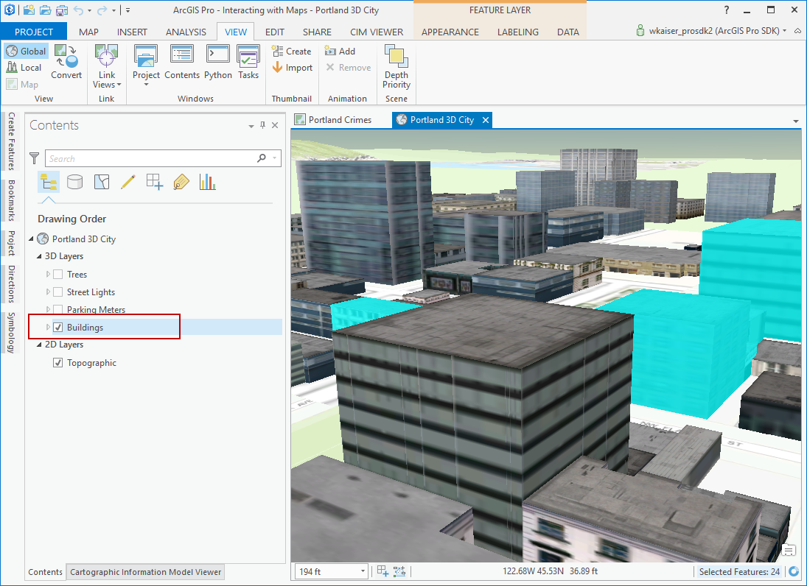  
1. View the "Cartographic Information Model Viewer" dockpane to see and/or manipulate the CIM for the selected layer.  
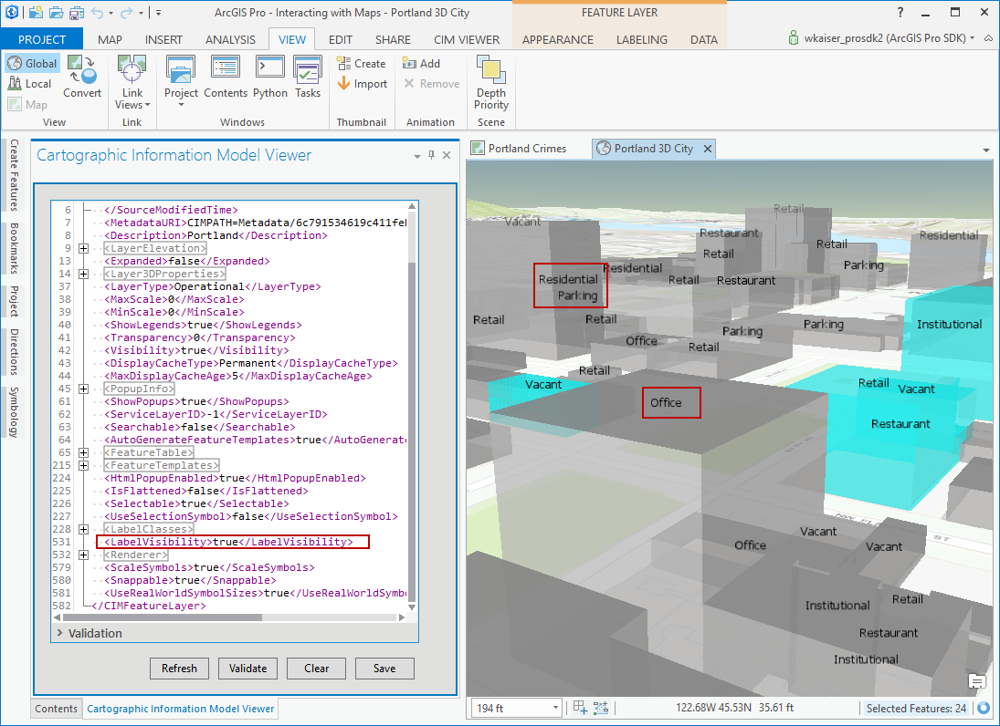  
1. To "post" (or save) any changes you made in the "Cartographic Information Model Viewer" dockpane back to ArcGIS Pro you can click the 'Save' button.
1. Select the map or scene node in the TOC to view its CIM
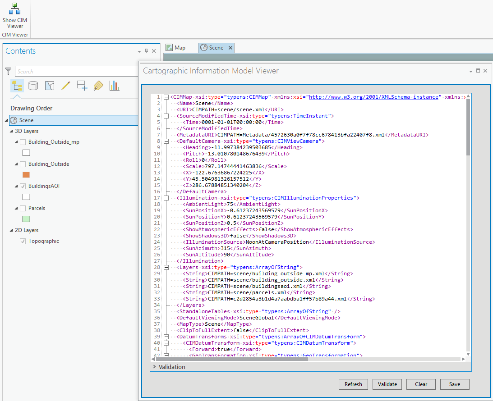

## CIMViewerAnno tool

1. Make sure you have the add-in built and available
1. Start ArcGIS Pro
1. Open any project that has an annotation layer
1. Open the CIMAnnoDockPane
1. Select any annotation feature to load its text graphic CIM definition
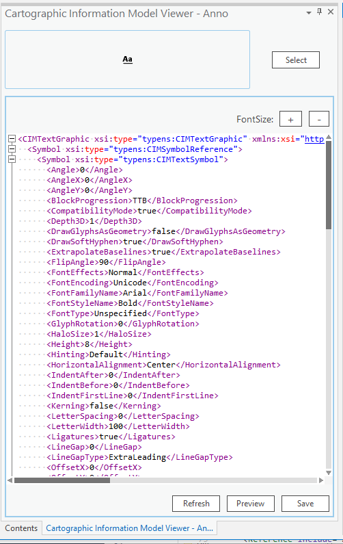
1. If you make changes to the CIM definition you can use "Preview" to change the preview image on the dockpane without changing the underlying annotation feature.
1. Select "Save" to apply your changes to the selected annotation feature (assuming you have the appropriate write permissions on the annotation feature class).

Note: Save will fail if you do not have edit permissions on the anno feature class or `annoFeatureClassDef.AreSymbolOverridesAllowed()` returns false.

Only included in the **2.x** and **3.0** sample

## PreviewSymbol tool

1. Make sure you have the add-in built and available
1. Start ArcGIS Pro
1. Open any project that has feature layers and/or anno layers
1. Open the CIMPreviewSymbol dockpane
1. Select any feature or anno feature to load its symbol into the viewer
1. If you select an anno feature _and_ a vector feature then the anno feature takes precedence
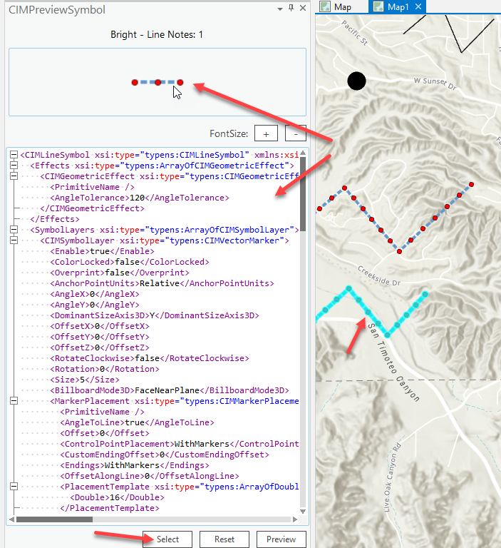
1. If you make changes to the CIM definition of the symbol you can use "Preview" to view those changes on the dockpane.
1. Select "Reset" to set the content back to the "original" selected symbol.
1. Use PreviewSymbol to help you understand the internal structure of CIM Symbols. It does _not_ apply any edits to the symbol CIM back to the selected feature.


## ArcGIS Pro SDK Resources

* [API Reference online](http://pro.arcgis.com/en/pro-app/sdk/api-reference)
* <a href="http://pro.arcgis.com/en/pro-app/sdk/" target="_blank">ArcGIS Pro SDK for .NET (pro.arcgis.com)</a>
* [arcgis-pro-sdk-community-samples](http://github.com/Esri/arcgis-pro-sdk-community-samples)
* [ArcGIS Pro DAML ID Reference](http://github.com/Esri/arcgis-pro-sdk/wiki/ArcGIS Pro DAML ID Reference)
* [FAQ](http://github.com/Esri/arcgis-pro-sdk/wiki/FAQ)
* [ArcGIS Pro SDK icons](https://github.com/Esri/arcgis-pro-sdk/releases/tag/1.2.0.5023)  

* [ProConcepts: ArcGIS Pro Add in Samples](https://github.com/Esri/arcgis-pro-sdk-community-samples/wiki/ProConcepts-ArcGIS-Pro-Add-in-Samples)

### Samples Data

* Sample data for ArcGIS Pro SDK Community Samples can be downloaded from the [repo releases](https://github.com/Esri/arcgis-pro-sdk-community-samples/releases) page. 

## Requirements
The requirements for the machine on which you develop your ArcGIS Pro add-ins are listed here. 

#### ArcGIS Pro

* ArcGIS Pro 3.3+
* ArcGIS Pro 3.0+
* ArcGIS Pro ~2.5~ 2.8

#### Supported platforms

* Windows 11
* Windows 10 (Home, Pro, Enterprise) (64 bit)
* Windows 8.1 (Pro, and Enterprise) (64 bit) 

#### Supported .NET framework

* version 3.3+ - Microsoft .NET 8+
* version 3.0+ - Microsoft .NET 6.0.5+
* version 2.x - Microsoft .NET Framework 4.8 Developer Pack

#### Supported IDEs

* version 3.3+ - Visual Studio 2022 17.8+
* version 3.0+ - Visual Studio 2022  17.2+
* version 2.x - Visual Studio 2019 (Professional, Enterprise, and Community Editions)

Note: [ArcGIS Pro system requirements](https://pro.arcgis.com/en/pro-app/get-started/arcgis-pro-system-requirements.htm) 

## Contributing

Esri welcomes contributions from anyone and everyone. Please see our [guidelines for contributing](https://github.com/esri/contributing).

Refer to this [wiki](https://github.com/Esri/arcgis-pro-sdk-community-samples/wiki/ProGuide-Contribute-Samples) for detailed instructions on the ArcGIS Pro SDK Samples submission process.

## Licensing
Copyright 2023 Esri

Licensed under the Apache License, Version 2.0 (the "License");
you may not use this file except in compliance with the License.
You may obtain a copy of the License at:

   http://www.apache.org/licenses/LICENSE-2.0.

Unless required by applicable law or agreed to in writing, software
distributed under the License is distributed on an "AS IS" BASIS,
WITHOUT WARRANTIES OR CONDITIONS OF ANY KIND, either express or implied.
See the License for the specific language governing permissions and
limitations under the License.

A copy of the license is available in the repository's [license.txt](./License.txt) file.

&nbsp;&nbsp;&nbsp;&nbsp;&nbsp;&nbsp;
&nbsp;&nbsp;&nbsp;&nbsp;&nbsp;&nbsp;&nbsp;&nbsp;&nbsp;&nbsp;&nbsp;&nbsp;
[Home](https://github.com/Esri/arcgis-pro-sdk/wiki) | <a href="http://pro.arcgis.com/en/pro-app/sdk/api-reference" target="_blank">API Reference</a> | [Requirements](https://github.com/Esri/arcgis-pro-sdk/wiki#requirements) | [Download](https://github.com/Esri/arcgis-pro-sdk/wiki#installing-arcgis-pro-sdk-for-net) | <a href="http://github.com/esri/arcgis-pro-sdk-community-samples" target="_blank">Samples</a>
